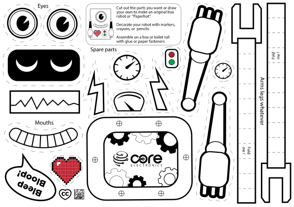
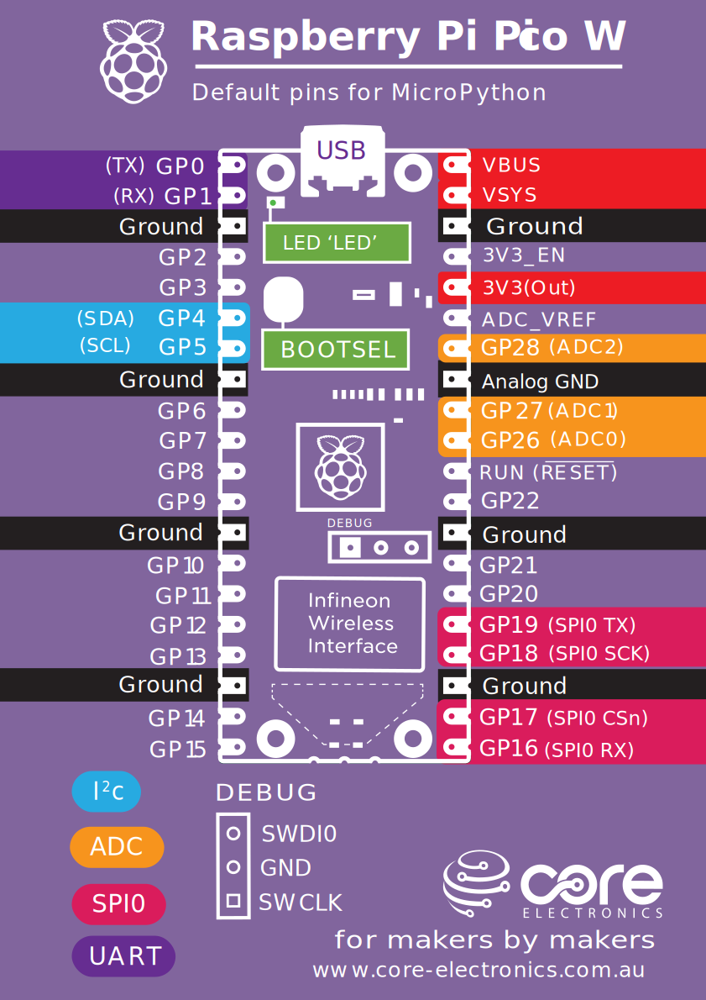
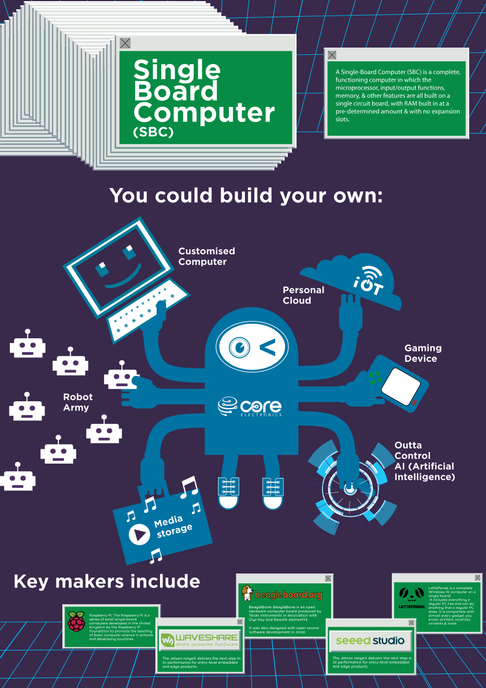
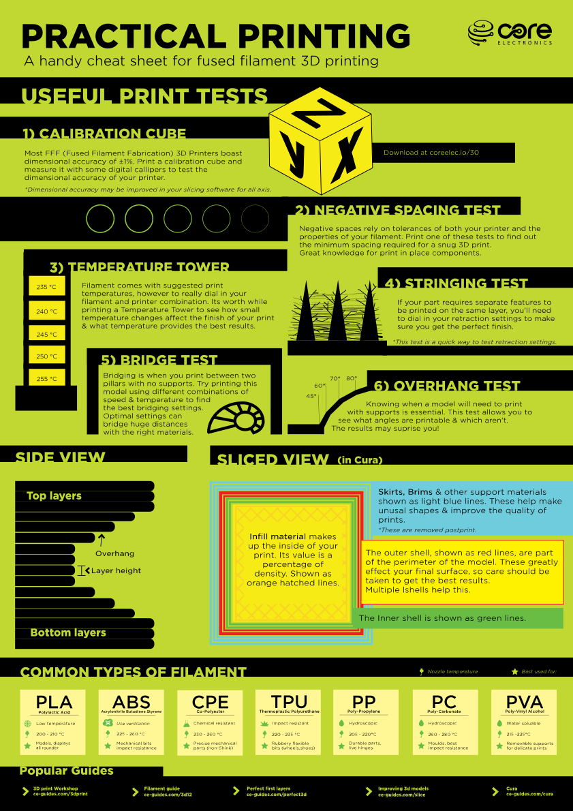
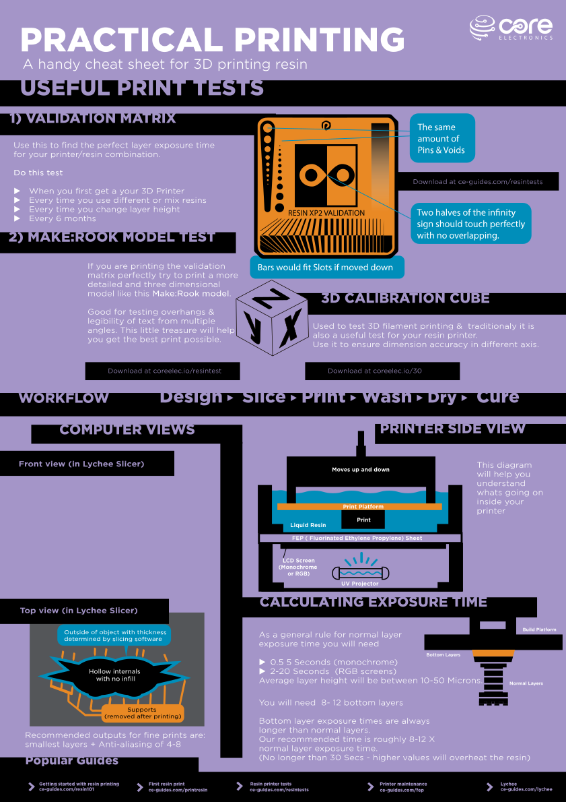

## How to Download this Artwork

There are two options:

- [Download the whole Art Pack](https://github.com/CoreElectronics/CE-Art-Pack/archive/refs/heads/main.zip)
- Download individual images: Right-click and select "Save image as..."

Get creative! This project is open source - You are free to share and adapt this work.

## Paper Cut-Out

### Paperbot

## Posters

### Raspberry Pi Pico W

### Single Board Computer

### FMD 3D Printing

### Resin 3D Printing

## License
Please review the LICENSE.md file for further licensing information.

If you have any technical questions, or concerns about licensing, please contact technical support on the [Core Electronics forums](https://forum.core-electronics.com.au/).
